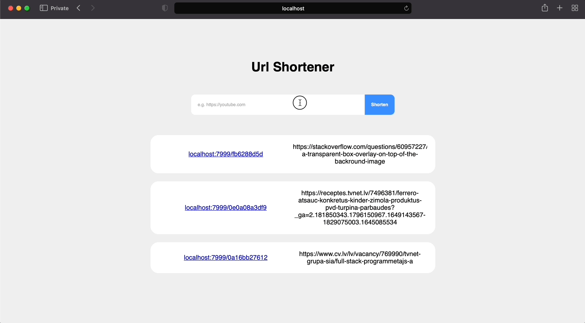

# Setup
- First you need to install all the packages. <code>composer install</code>
- Create a <code>.env</code> file, configure it based on the <code>.env.example</code> file.
- Create a table. I provided the schema for the table in the <code>tableSchema.sql</code>.
- Finally use this command to setup a local server <code>php -S localhost:8000</code>.
(Note - You do not have to use this exact port.)

# Demo 

